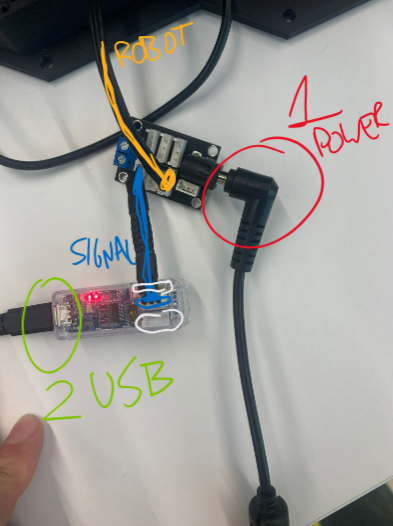
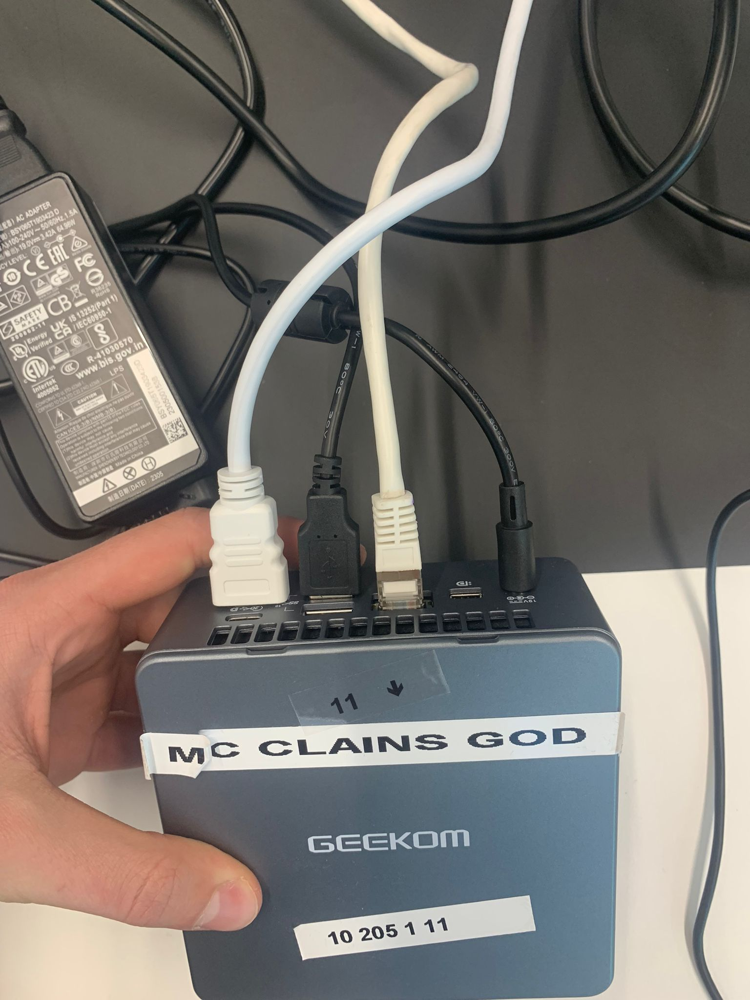
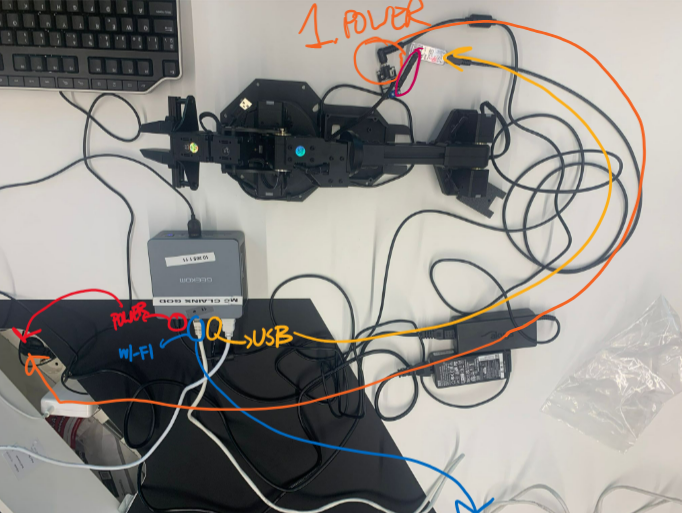

# Set Up

## Robot - Linux computer SetUp

This case we are setting up the work station planning to move and connect to the wx250s using a powerfull computer with **Ubuntu Linux and the full installation** already done.

<details>
  <summary><strong>Hardwrae set up procedure</strong></summary>

1. Connect the power board to the signal board with the shor cable bridge
2. Connect also the robot to the power board

<p align="center">

</p>

3. Power up the robot with proper supply
4. Using a USB cable connect the signal board to the computer

>_(it is important to power the robot before connecting it to the computer, or it will give errors)_

5. Prepare the computer, power it (with proper power supply), connect mouse and keyboard, cconnect trough HDMI cable to screen, connect LAN ethernet cable and as said before attach USB cable for sending signals to robot.


<p align="center">

</p>

<p align="center">

</p>


</details>

To check hardware set up is correct, go to device directory and check for the Robot peripheral existence (**ttyDXL**)

```
cd /dev
ls → will give ttyDXL
ll → will give ttyDXL→ttyUSB0
```


<br>
<br>

## Robot+Raspberry Pi - Personal Computer SetUp

<details>
  <summary><strong>Procedure</strong></summary>

Still not working... comming soon


</details>

<br>

