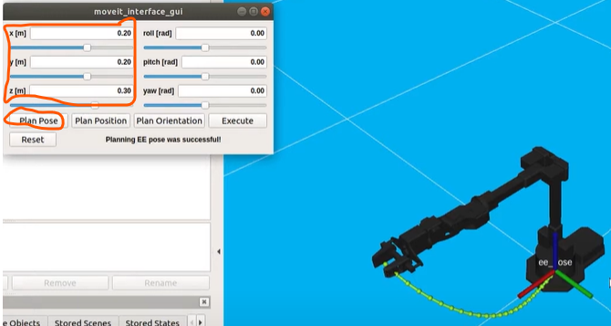

# Moveit

## Robot - Linux computer Moveit packages

<strong>Moveit comands</strong>

  

  
<strong>C++</strong>

  Simulate it first:

  `roslaunch interbotix_xsarm_moveit_interface xsarm_moveit_interface.launch robot_model:=wx250s use_fake:=true dof:=6 use_cpp_interface:=true`

  Move real robot:

  `roslaunch interbotix_xsarm_moveit_interface xsarm_moveit_interface.launch robot_model:=wx250s dof:=6 use_cpp_interface:=true use_actual:=true`

   

  Each button in the gui interface is a ros node that send message to actual node (move group API) [see it here in github: interbotix_ros_toolboxes/interbotics_common_toolbox/interbotics_moveit_interface/src → moveit_interface_obj.cpp]

  Buttons explenation:

  - Plan Pose

    Set end-effector cordinates&orientation → es:
    

    
    

  - Plan Position:

    Reach what ever position regardless the orientation (orientation arbitary)

  - Plan Orientation:

    Reach what ever orientation regardless the position (position arbitary)

  - Execute:

    Execute movment

  - Reset:

    Go back to 0

  

  

  
Python

`roslaunch interbotix_xsarm_moveit_interface xsarm_moveit_interface.launch robot_model:=wx250s use_fake:=true dof:=6 use_python_interface:=true`

Python script running! find it here: [github: interbotix_ros_toolboxes/interbotics_common_toolbox/interbotics_moveit_interface/scripts/moveit_python_interface]

1. press enter in the terminal → start tutorial
2. press enter to continue the demo

  

 
 

## Robot+Raspberry Pi - Personal Computer Moveit packages

  
<strong>Moveit comands</strong>

Still not working... comming soon

 

