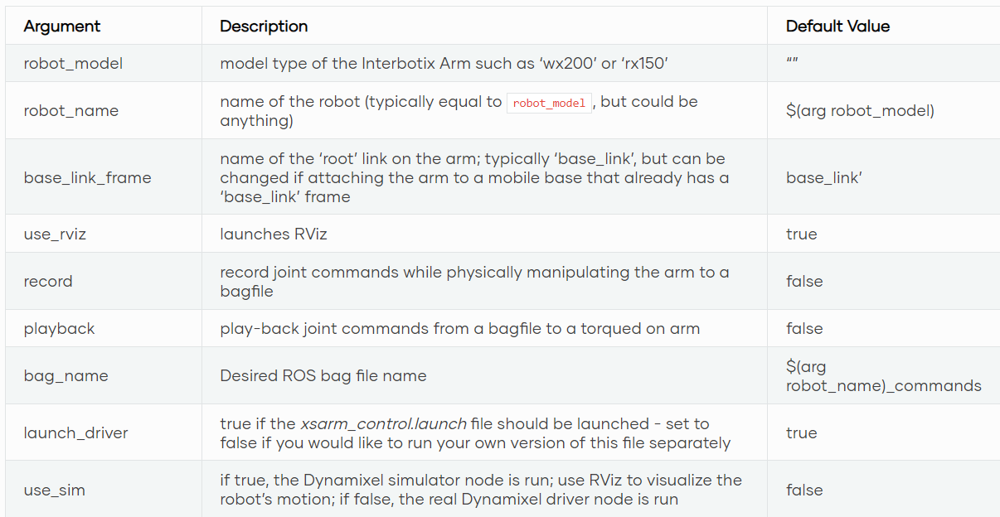

# Record & Play Bag

## Usage

### Where?

`interbotix_ws/src/interbotix_ros_manipulators/interbotix_ros_xsarms/examples/interbotix_xsarm_puppet`

### Record Bag

- Record bag, **record:=true**: `roslaunch interbotix_xsarm_puppet xsarm_puppet_single.launch robot_model:=wx250s record:=true`

Now you can move the robot manually and the moovments will be saved in to a ros bag (.bag fail).

- Check bag that was created in bag directory: `cd interbotix_ws/src/interbotix_ros_manipulators/interbotix_ros_xsarms/examples/interbotix_xsarm_puppet/bag`

### Repeat Moovemnts (Playback)

- Play bag, **playback:=true bag_name:=<bagname>**: `roslaunch interbotix_xsarm_puppet xsarm_puppet_single.launch robot_model:=wx250s playback:=true bag_name:=<bagname>`

## Resources

- [Offical documentation](https://docs.trossenrobotics.com/interbotix_xsarms_docs/ros1_packages/record_and_playback.html)
- [GitHub](https://github.com/Interbotix/interbotix_ros_manipulators/tree/main/interbotix_ros_xsarms/examples/interbotix_xsarm_puppet)

