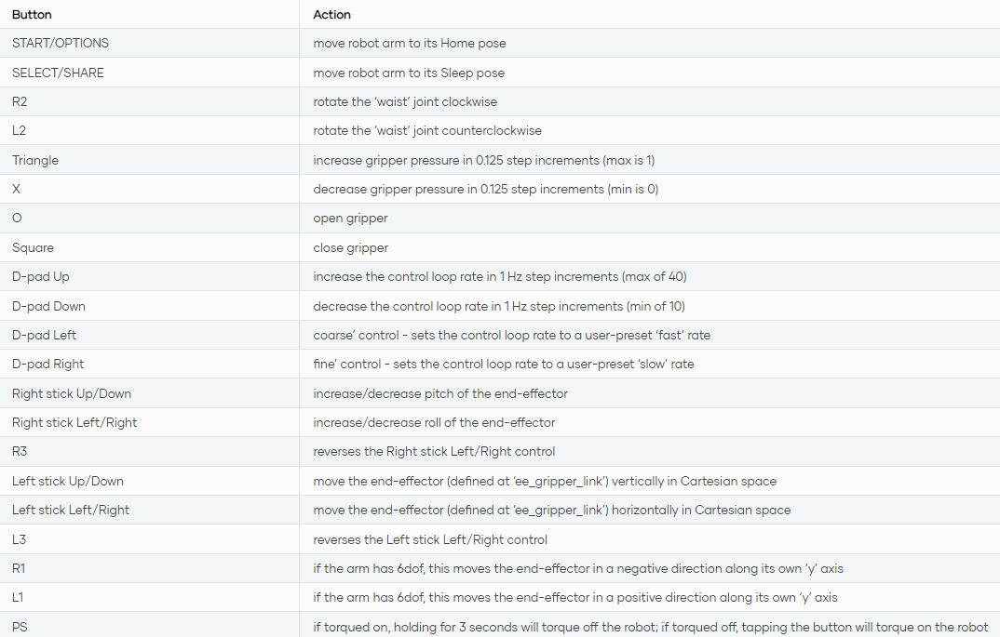

# Use Joystic

## Move robot with Blewtooth controller

  
<strong>Connect PS4 conrtroller</strong>

1. Connect PS4 to computer:

    - Turn on Bluetooth of computer
    - Press PS button + share untill flash on controller

2. Package name:

    - **interbotix_xsarm_joy**

      1. The pakage has 3 parts: joy node (driver from joystik to linux), xsarm_joy node (reade messages and interpret them) xsarm_robot (allow position-ik). All 3 nodes are launched with [launch file](https://github.com/Interbotix/interbotix_ros_manipulators/blob/main/interbotix_ros_xsarms/examples/interbotix_xsarm_joy/launch/xsarm_joy.launch)

      2. [config file](https://github.com/Interbotix/interbotix_ros_manipulators/blob/main/interbotix_ros_xsarms/examples/interbotix_xsarm_joy/config/modes.yaml)

3. Launch package:

  `roslaunch interbotix_xsarm_joy xsarm_joy.launch robot_model:=wx250s`

## Resources

- [Offical documentation](https://docs.trossenrobotics.com/interbotix_xsarms_docs/ros1_packages/joystick_control.html)
- [Offical video tutorial](https://www.youtube.com/watch?v=AyKjcZvu8lo&list=PL8X3t2QTE54sMTCF59t0pTFXgAmdf0Y9t&index=13)

